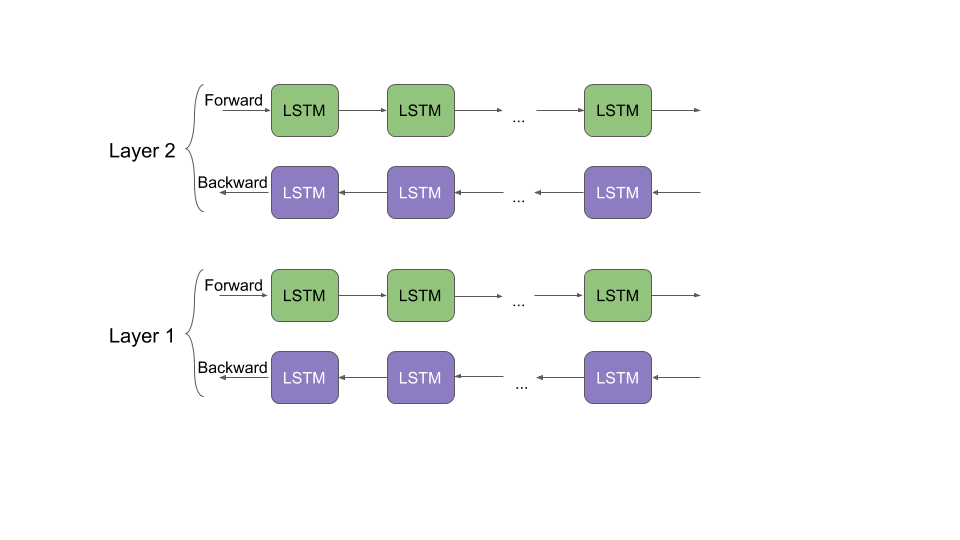

# ELMO(Embeddings from Language Models).

This repository contains implementations of ELMo (Embeddings from Language Models) models trained on a news dataset. Additionally, it includes a classification task using ELMo embeddings.

## ELMo
  ELMo (Embeddings from Language Models) is a deep contextualized word representation model developed by researchers at Allen Institute for Artificial Intelligence (AI2). Unlike traditional word embeddings like Word2Vec or GloVe, ELMo captures word meanings in context by considering the entire input sentence.
  

### How Does ELMo Work?

The architecture of ELMo revolves around a two-layer bidirectional language model (biLM) that processes input text at the character level. Here's a breakdown of how ELMo works:

- Character-Level Representation:
ELMo uses a character-level convolutional neural network (CNN) to encode the raw characters of a word into initial word vectors.
- BiLM Architecture:
Forward Pass: The biLM processes the text in the forward direction, capturing information about each word and the context before it.
Backward Pass: Simultaneously, the biLM processes the text in the backward direction, capturing information about each word and the context after it.
- Intermediate Word Vectors:
The outputs from both the forward and backward passes form intermediate word vectors, which encode the contextual information surrounding each word.
- Combination into ELMo Vectors:
The final ELMo word vectors are computed as a weighted sum of the initial word vectors, the intermediate forward pass vectors, and the intermediate backward pass vectors.
- Contextual Understanding:
ELMo's ability to generate word representations based on context allows it to capture nuanced meanings of words that vary depending on their usage in sentences. For example, ELMo can differentiate between "bank" in "river bank" and "bank" in "bank account" based on the surrounding text.

By leveraging bidirectional language modeling and deep learning techniques, ELMo enhances the semantic understanding of sentences and words, making it a powerful tool for various natural language processing tasks like text classification, named entity recognition, and question answering.


## Files Structure
- **code**: This directory contains the following .py files:
  - `elmo.py`: Contains the implementation of the ELMo embedding. By default, it runs on a pretrained model.
  - `classification.py`: Trains an RNN (LSTM) on the classification task using the ELMo word vectors. By default, it runs on a pretrained model.
- **2022201020_Assignment_4**: This directory contains hyperparameters used to train the model(s), corresponding graphs and evaluation metrics, and analysis of the results.
- **models**: This directory contains trained models (`bilstm.pt`, `classifier.pt`).
- **data**: This directory contains training and test data .csv files and also contains embedding files.

## Execution


To execute the models, follow these steps:

1. Open a terminal.
2. Run the following commands:
    ```bash
    $ python elmo.py
    $ python classification.py
    ```

## Note


By default the classification Task run on the pre-trained mode it inly give the test accuray and also take the user input and pridict the lable. If you want to train model again the uncomment some line in the code which i have mention in the code where you have to un comment the line for training the classification model

## Assumptions
- 1,20,000 sentences are used for creating the embeddings.

**For a detailed description of the task, please refer to the [assignment PDF](./docs/iNLP_Assignment_4.pdf) To review the results, you can access the [report PDF](./docs/2022201020_Assignment_4.pdf)**

For the complete dataset and other supplementary files, refer to the [Google Drive link](https://drive.google.com/drive/folders/1gPa3qXLQWSW62SZekWwaDblGVkTVGptt?usp=sharing) provided.

**Please download the "data" and "models" folders from the following link before running the .py files because I have hard-coded the file and models paths in the .py files.**

---> https://drive.google.com/drive/folders/1nXl6xrnW4Nl7owjGAGpKcf7xCVztqfu8?usp=sharing

**Submitted by:** 2022201020
